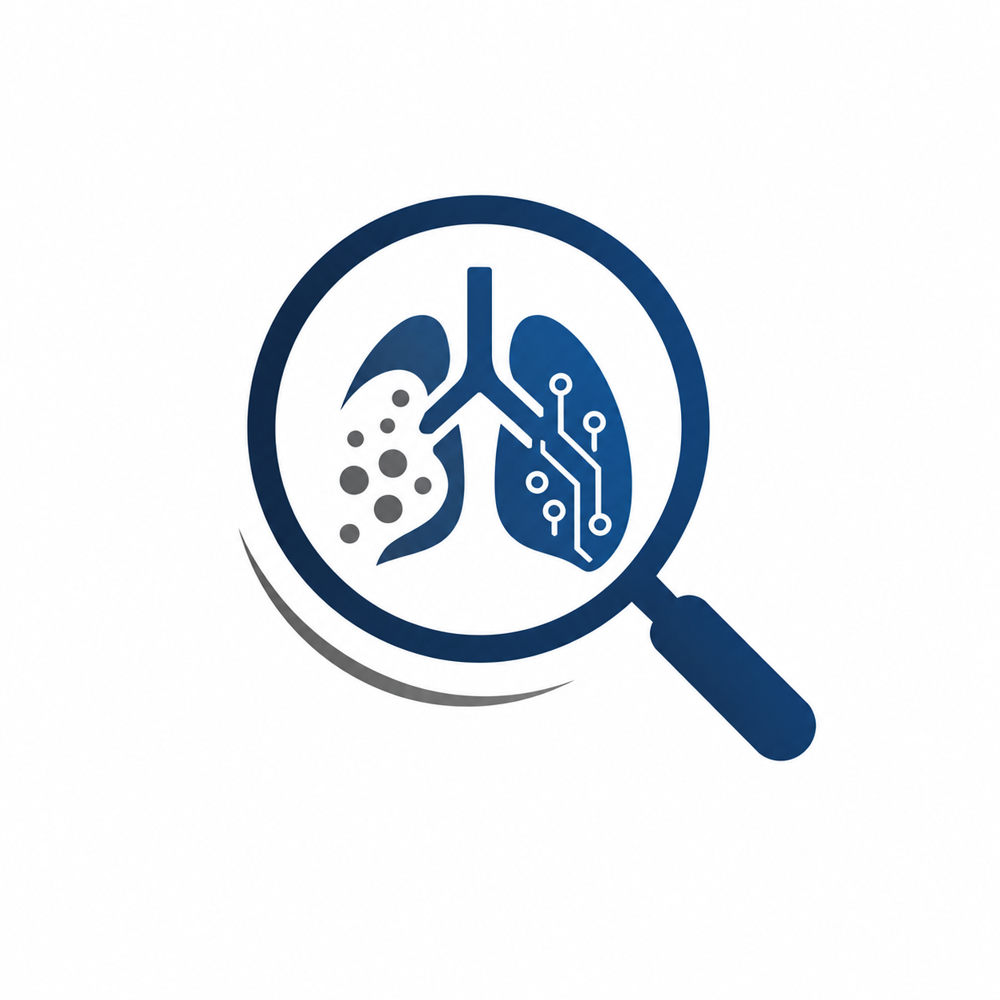

#  Silicoscan

**Sistem Skrining Paru-Paru Berbasis AI untuk Deteksi Dini Silikosis**

Aplikasi web prototipe untuk skrining awal kondisi paru-paru pekerja tambang menggunakan foto rontgen dada (chest X-ray). Sistem ini dirancang ringan dan portabel (Portable Edition) dengan menggunakan format ONNX, yang menjalankan pipeline dua tahap untuk memberikan hasil analisis yang komprehensif.

---

## 🔬 Arsitektur & Cara Kerja

Sistem ini tidak lagi menggunakan classifier terpisah, melainkan langsung berfokus pada melokalisasi dan mendeteksi probabilitas abnormalitas menggunakan pendekatan deteksi objek setelah paru-paru disegmentasi.

```text
Upload X-Ray → [U-Net Masking] → [YOLO Detection] → Hasil Lokasi & Kelas Abnormalitas 🔍
```

### 2 Tahap Pipeline AI:

| Tahap | Model AI | Format & Kompresi | Fungsi Utama |
|-------|-----------|--------|--------------|
| **Tahap 1: Segmentasi Paru** | U-Net (ResNet34 backbone) | ONNX (FP32) | Memotong (crop) area paru-paru dari *background* untuk menghilangkan noise di luar region-of-interest. |
| **Tahap 2: Deteksi Lesi** | YOLO11s | ONNX (FP16) | Mencari, mendeteksi, dan menandai lokasi spesifik serta memberikan nilai *confidence* untuk setiap temuan. |

### Pilihan Model Deteksi
Terdapat 2 opsi model deteksi yang dapat dipilih pengguna saat melakukan skrining:
1. **Model Deteksi Biasa (3 Kelompok Utama)**: Mengelompokkan penyakit paru menjadi 3 kategori: *Silicosis Nodular*, *Silicosis Advanced Fibrotic*, dan *Other Lung Abnormality*.
2. **Model Deteksi Full (11 Kelas Detail)**: Mendeteksi kelainan secara spesifik dari 11 kelas tanpa pengelompokan.

---

## 🎯 Tingkat Akurasi
Model-model AI pada aplikasi ini telah melalui proses *training* dan validasi pada dataset citra rontgen pekerja tambang. Optimalisasi kompresi ke format ONNX (*FP16* untuk deteksi, *FP32* untuk masking) menjaga tingkat akurasi tetap presisi dengan konsumsi *resource* hardware yang jauh lebih efisien dan ringan.

---

## 🚀 Cara Pakai & Instalasi (Portable)

Aplikasi ini sudah dioptimalkan agar sepenuhnya **mandiri (standalone)**. Seluruh model dan *dependencies* sudah dirancang agar dapat langsung dijalankan di sistem operasi standar tanpa perlu pengaturan Python PyTorch yang berat.

### Prasyarat Umum
- Python 3.10 atau lebih baru terpasang di sistem.

### 🪟 Windows

Cukup jalankan dua file batch berikut:
1. **Setup Awal** (Hanya 1x saat pertama kali instal):
   ```cmd
   install_windows.bat
   ```
2. **Menjalankan Server**:
   ```cmd
   run.bat
   ```

### 🍏 Linux / macOS

1. **Setup Awal** (Hanya 1x):
   ```bash
   chmod +x install_linux.sh run.sh
   ./install_linux.sh
   ```
2. **Menjalankan Server**:
   ```bash
   ./run.sh
   ```

### 🐳 Menggunakan Docker (Rekomendasi untuk Server)

```bash
docker-compose up --build -d
```
Aplikasi akan langsung berjalan di *background*. Cocok untuk langsung dipasang pada VPS Linux.

---

## 🌐 Cara Penggunaan (Web Interface)

1. Buka browser dan akses: **http://localhost:8000**
2. Pilih opsi **Mulai Skrining**.
3. Unggah foto rontgen dada dengan format standar (JPG/PNG/JPEG).
4. Pilih **Model Deteksi** (Biasa atau Full) dari menu *dropdown*.
5. Klik **Mulai Analisis AI**.
6. Sistem akan mengeksekusi pipeline dan menampilkan gambar hasil segmentasi dan hasil *bounding box* lesi dalam hitungan detik (kurang dari 5 detik).

---

## ⚙️ Konfigurasi Lanjutan
Untuk kebutuhan riset atau *tweaking*, modifikasi file `config.py` untuk menyesuaikan:
- *Confidence threshold* deteksi AI
- Path atau letak model ONNX 
- Warna *bounding box* untuk setiap kelas penyakit

---

## 🛠️ Tech Stack & Modul

- **Backend / API**: FastAPI + Uvicorn
- **AI Inference Engine**: ONNX Runtime (Super ringan & CPU-friendly)
- **Image Processing**: OpenCV, NumPy, Pillow
- **Frontend**: Vanilla HTML / CSS (Flexbox & CSS Grid) / JS (Asynchronous Fetch)

---

## ⚠️ Disclaimer Medis

Aplikasi ini dikembangkan untuk keperluan prototipe dan riset keselamatan kesehatan kerja (K3) untuk deteksi awal *Silikosis*. Hasil yang diberikan **BUKAN** merupakan diagnosis medis akhir. Selalu lakukan validasi dan pemeriksaan klinis bersama ahli medis (Radiolog/Dokter Paru) yang berwenang.
